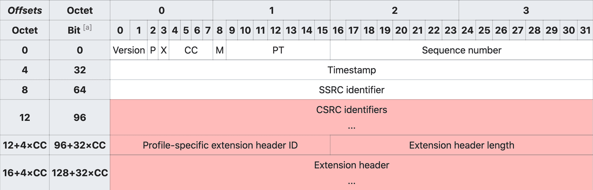

# 参考文档

[RTP/RTCP RTSP协议讲解](https://zhuanlan.zhihu.com/p/689187765)

# 1. RTP/RTCP RTSP协议讲解

<font color=red>**用一句简单的话总结：RTSP发起/终结流媒体、RTP传输流媒体数据 、RTCP对RTP进行控制、同步。**</font>

## 1.1 RTP

### 1.1.1 RTP概述

RTP（Real-time Transport Protocol）是用于 Internet 上针对多媒体数据流的一种传输层协议，RTP 协议和 RTP 控制协议 RTCP 一起使用。**RTP 被定义为在一对一或一对多的传输情况下工作，其目的是提供时间信息和实现流同步**。RTP 的典型应用建立在 UDP 上，但也可以在 TCP 或 ATM 等其他协议之上工作。

<font color=red>**RTP 本身只保证实时数据的传输，并不能为按顺序传送数据包提供可靠的传送机制，也不提供流量控制或拥塞控制，它依靠 RTCP 提供这些服务。**</font>**rtp 协议就是提供了时间标签，序列号以及其它的结构用于控制适时数据的流放。**

在流的概念中” 时间标签” 是最重要的信息。发送端依照即时的采样在数据包里隐蔽的设置了时间标签。在接受端收到数据包后，就依照时间标签按照正确的速率恢复成原始的适时的数据。不同的媒体格式调时属性是不一样的。

 rtp 本身并不负责同步，rtp 只是传输层协议，为了简化运输层处理，提高该层的效率。 将部分运输层协议功能（比如流量控制）上移到应用层完成。同步就是属于应用层协议完成的。它没有运输层协议的完整功能，不提供任何机制来保证实时地传输数据，不支持资源预留，也不保证服务质量。rtp 报文甚至不包括长度和报文边界的描述。**同时 rtp 协议的数据报文和控制报文的使用相邻的不同端口，这样大大提高了协议的灵活性和处理的简单性**。

rtp 协议和 udp 二者共同完成运输层协议功能。udp 协议只是传输数据包，不管数据包传输的时间顺序。rtp 的协议数据单元是用 udp 分组来承载的。在承载 rtp 数据包的时候，有时候一帧数据被分割成几个包具有相同的时间标签，则可以知道时间标签并不是必须的。而 udp 的多路复用让 rtp 协议利用支持显式的多点投递，可以满足多媒体会话的需求。

### 1.1.2 RTP 协议的报文结构



一个RTP 包 由 RTP header + payload组成。如图所示，RT(D)P header 最小为 12 bytes；红色部分为可选字段。字段的含义分别如下：

- **Version** 表示 RTP 协议的版本，目前版本为 2。
- **P (Padding)** 表示 RT(D)P 包末尾是否有 padding bytes，且 padding bytes 的最后一个 byte 表示 bytes 的数量。Padding 可以被用来填充数据块，比如加密算法可能会用到。
- **X (Extension)** 表示是否有头部扩展，头部扩展可以用于存储信息，比如视频旋转角度。
- **CC (CSRC count)** 表示红色部分的 CSRC（参见下文）数量，显然最多只能有 15 个 CSRC。
- **M (Marker)** 表示当前数据是否与应用程序有某种特殊的相关性。比如传输的是一些私有数据，或者数据中的某些标志位具有特殊的作用。
- **PT (Payload type)** 表示 payload 的数据类型，音视频的默认映射格式可参见 [RFC 3551](https://tools.ietf.org/html/rfc3551#page-32)。
- **Sequence number** 是递增的序列号，用于标记每一个被发送的 RT(D)P 包。接收方可以根据序列号按顺序重新组包，以及识别是否有丢包。序列号的初始值应当是随机的（不可预测的），从而增加明文攻击的难度。
- **Timestamp** 即时间戳，接收方根据其来回放音视频。时间戳的间隔由传输的数据类型（或具体的应用场景）确定，比如音频通常以 125µs（8kHz）的时钟频率进行采样，而视频则以 90kHz 的时钟频率采样。这里时间戳的初始值也是随机选取的，是一种相对时间戳。
- **SSRC (Synchronization source)** 即同步源标识符。相同 RTP 会话中的 SSRC 是唯一的，且生成的 SSRC 也需要保持随机。尽管多个源选中同一个标识符的概率很低，但具体实现时仍然需要这种情况发生，即避免碰撞。
- **CSRC (Contributing source)** 在 MCU 混流时使用，表示混流出的新的音视频流的 SSRC 是由哪些源 SSRC 贡献的。根据上述 CC 得知，我们最多可以同时混 15 路音视频流。
- **Extension header** 即头部扩展，包含了音视频的一些额外信息，比如视频旋转角度。

当应用程序建立一个RTP会话时，应用程序将确定一对目的传输地址。目的传输地址由一个网络地址和一对端口组成，有两个端口：一个给RTP包，一个给RTCP包，使得RTP/RTCP数据能够正确发送。RTP数据发向偶数的UDP端口，而对应的控制信号RTCP数据发向相邻的奇数UDP端口（偶数的UDP端口+1），这样就构成一个UDP端口对。 RTP的发送过程如下，接收过程则相反。

1) RTP协议从上层接收流媒体信息码流（如H.263），封装成RTP数据包；RTCP从上层接收控制信息，封装成RTCP控制包。

2. RTP将RTP数据包发往UDP端口对中偶数端口；RTCP将RTCP控制包发往UDP端口对中的接收端口。

## 1.2 RTCP

### 1.2.1 RTCP概述

RTCP（Real-time Transport Control Protocol ），和 RTP 协议一起使用，而且它是建立在 UDP 协议上的。RTCP 负责管理传输质量在当前应用进程之间交换控制信息。**在 RTP 会话期间，各参与者周期性地传送 RTCP 包，包中含有已发送的数据包的数量、丢失的数据包的数量等统计资料**。因此，**服务器可以利用这些信息动态地改变传输速率，甚至改变有效载荷类型**。

RTP 和 RTCP 配合使用，能以有效的反馈和最小的开销使传输效率最佳化，故特别适合传送网上的实时数据。根据用户间的数据传输反馈信息，可以制定流量控制的策略，而会话用户信息的交互，可以制定会话控制的策略。

### 1.2.2 RTCP协议的报文结构

> 在传统的实时通讯过程中，RTP 协议占用偶数位的端口，而 RTCP 协议占用随后的奇数位端口。不过如果接收方的 SDP 中包含 `rtcp-mux` 字段，即表明接收方支持 RTP 协议和 RTCP 协议共用同一个端口，即多路复用。在 Chrome 57 版本已经强制开启了 `rtcp-mux` 。

对于 RTCP 包，我们不只要关注 header 的结构，还要关注具体的 report block 内容。一个典型的 RTCP header 结构，如下图所示：


RTCP header 的固定大小为 8 bytes，其中 Version、P、SSRC 的含义同 RTP header 相同。其他几个字段的含义分别如下：

- **RC (Reception report count)** 表示当前 RTCP 包有几个 block，显然最多只能有 32 个。
- <font color=red>**PT (Packet type)** 表示 RTCP 包的类型，比如 **SR=200、RR=201**（SR、RR 参见下文）。</font>
- **Length** 等于整个 RTCP 包的长度**减一**（使得 Length = 0 是合法的），其值包含 header 的长度和所有 padding 占用的空间长度。值的单位是以 32 位字长（32-bit words）描述的。


> 其他补充：
>
> 在 RTCP 通信控制中，RTCP 协议的功能是通过不同的 RTCP 数据报来实现的，主要有如下几种类型：
>
> - **SR：发送端报告**，所谓发送端是指发出 RTP 数据报的应用程序或者终端，发送端同时也可以是接收端。
>
> - **RR：接收端报告**，所谓接收端是指仅接收但不发送 RTP 数据报的应用程序或者终端。
>
> - SDES：源描述，主要功能是作为会话成员有关标识信息的载体，如用户名、邮件地址、电话号码等，此外还具有向会话成员传达会话控制信息的功能。
>
> - BYE：通知离开，主要功能是指示某一个或者几个源不再有效，即通知会话中的其他成员自己将退出会话。
>
> - APP：由应用程序自己定义，解决了 RTCP 的扩展性问题，并且为协议的实现者提供了很大的灵活性。
>
> 

### 1.2.3 SR & RR

PT=SR=200 时，表示这个 RTCP 包记录的是**发送方**的质量数据（Sender Report）；PT=RR=201 时，表示这个 RTCP 包记录的是**接收方**的质量数据（Receiver Report）。SR 和 RR 的结构几乎一致，除了 RR 没有 sender info。先来看 SR 的结构：

```Shell
0                   1                   2                   3
        0 1 2 3 4 5 6 7 8 9 0 1 2 3 4 5 6 7 8 9 0 1 2 3 4 5 6 7 8 9 0 1
       +-+-+-+-+-+-+-+-+-+-+-+-+-+-+-+-+-+-+-+-+-+-+-+-+-+-+-+-+-+-+-+-+
header |V=2|P|    RC   |   PT=SR=200   |             length            |
       +-+-+-+-+-+-+-+-+-+-+-+-+-+-+-+-+-+-+-+-+-+-+-+-+-+-+-+-+-+-+-+-+
       |                         SSRC of sender                        |
       +=+=+=+=+=+=+=+=+=+=+=+=+=+=+=+=+=+=+=+=+=+=+=+=+=+=+=+=+=+=+=+=+
sender |              NTP timestamp, most significant word             |
info   +-+-+-+-+-+-+-+-+-+-+-+-+-+-+-+-+-+-+-+-+-+-+-+-+-+-+-+-+-+-+-+-+
       |             NTP timestamp, least significant word             |
       +-+-+-+-+-+-+-+-+-+-+-+-+-+-+-+-+-+-+-+-+-+-+-+-+-+-+-+-+-+-+-+-+
       |                         RTP timestamp                         |
       +-+-+-+-+-+-+-+-+-+-+-+-+-+-+-+-+-+-+-+-+-+-+-+-+-+-+-+-+-+-+-+-+
       |                     sender's packet count                     |
       +-+-+-+-+-+-+-+-+-+-+-+-+-+-+-+-+-+-+-+-+-+-+-+-+-+-+-+-+-+-+-+-+
       |                      sender's octet count                     |
       +=+=+=+=+=+=+=+=+=+=+=+=+=+=+=+=+=+=+=+=+=+=+=+=+=+=+=+=+=+=+=+=+
report |                 SSRC_1 (SSRC of first source)                 |
block  +-+-+-+-+-+-+-+-+-+-+-+-+-+-+-+-+-+-+-+-+-+-+-+-+-+-+-+-+-+-+-+-+
  1    | fraction lost |       cumulative number of packets lost       |
       +-+-+-+-+-+-+-+-+-+-+-+-+-+-+-+-+-+-+-+-+-+-+-+-+-+-+-+-+-+-+-+-+
       |           extended highest sequence number received           |
       +-+-+-+-+-+-+-+-+-+-+-+-+-+-+-+-+-+-+-+-+-+-+-+-+-+-+-+-+-+-+-+-+
       |                      interarrival jitter                      |
       +-+-+-+-+-+-+-+-+-+-+-+-+-+-+-+-+-+-+-+-+-+-+-+-+-+-+-+-+-+-+-+-+
       |                         last SR (LSR)                         |
       +-+-+-+-+-+-+-+-+-+-+-+-+-+-+-+-+-+-+-+-+-+-+-+-+-+-+-+-+-+-+-+-+
       |                   delay since last SR (DLSR)                  |
       +=+=+=+=+=+=+=+=+=+=+=+=+=+=+=+=+=+=+=+=+=+=+=+=+=+=+=+=+=+=+=+=+
report |                 SSRC_2 (SSRC of second source)                |
block  +-+-+-+-+-+-+-+-+-+-+-+-+-+-+-+-+-+-+-+-+-+-+-+-+-+-+-+-+-+-+-+-+
  2    :                               ...                             :
       +=+=+=+=+=+=+=+=+=+=+=+=+=+=+=+=+=+=+=+=+=+=+=+=+=+=+=+=+=+=+=+=+
       |                  profile-specific extensions                  |
       +-+-+-+-+-+-+-+-+-+-+-+-+-+-+-+-+-+-+-+-+-+-+-+-+-+-+-+-+-+-+-+-+
```

对于 SR 而言，sender info 结构中的字段含义分别如下：

- **NTP timestamp** 即 NTP 时间戳。完整的 NTP 时间戳为 64 位无符号定点（fixed-point）数，可以和 RR 中的时间戳计算出对应接收方的 Round-Trip Time（RTT）。
- **RTP timestamp** 对应上述 NTP 时间戳的同一时间，但是与 RT(D)P 时间戳的单位和偏移量保持一致。这种对应关系可以用于媒体源的帧间或帧内同步（如果它们的 NTP 时间戳也是同步的话），也可以被媒体无关（media-independent）的接收方用于估算 RTP 时钟频率。
- **sender’s packet count** 即截止到当前 SR 生成时，发送方一共传输了多少个 RT(D)P 包。如果发送方的 SSRC 改变了，则该计数值将会被重置。
- **sender’s octet count** 即截止到当前 SR 生成时，发送方一共传输了多少个 RT(D) payload 字节（并不包括 header 和 padding）。如果发送方的 SSRC 改变了，则该计数值将会被重置。这个值可以被用来估算**有效负载**的平均传输速率。

SR 和 RR 具有相同的 report block 结构，其中各个字段的含义分别如下：

- **fraction lost** 表示最近一次 SR 或 RR 发送后，对应 SSRC 的发送方的 RT(D)P 丢包率，为 8 位定点数，换算为百分比的公式为 `percentage = fractionLost * 100 / 256` 。值等于发送方实际丢包数（参见下文）除以接收方期望收到的包数量（参见下文）。

- **packets lost** 表示截止到当前实时通话时，对应 SSRC 的发送方的 RT(D)P 累计丢包数。值等于接收方期望收到的包数量减去实际收到的包数量，即上述「发送方实际丢包数」。

- **extended highest sequence number received** 低 16 位为接收方从对应 SSRC 的发送方收到的最大的 RT(D)P sequence number，高 16 位为对应的 sequence number 循环次数。而对应的计算值便是上述「接收方期望收到的包数量」。

- **interarrival jitter** 为接收方收到 RT(D)P 包的间隔时间的统计方差，为无符号整数时间值。
- **LSR** 表示接收方收到对应 SSRC 的发送方的最近一次 SR 中的 NTP 时间戳，采用的是更加紧凑的 32 位表示方法。如果没有 SR 被收到过，则这个值为零。

- **DLSR** 表示接收方收到对应 SSRC 的发送方的最近一次 SR 的时间，和接收方发送 RR 的时间差，单位为 `1/65536` 秒。如果没有 SR 被收到过，则这个值为零。

细心的读者可能会发现，report block 中的字段基本都与接收方有关，即与 RR 有关。事实也的确如此，RR 的 report block 内容只与 SR 的 header、sender info 以及接收时间有关，因此 SR 的 report block 是可有可无的。比如笔者在实际工作中使用的 mediasoup（SFU）便是选择自己消费掉所有收到的 SR，而它生成的新的 SR 并不包含 report block [8](https://mthli.xyz/rtp-introduction/#fn-8)。

## 1.3 RTSP

### 1.3.4 RTP和RTSP的关系

#  2. SDP

SDP：会话描述协议，是一种会话描述格式，为描述多媒体数据而设计。
SDP协议介绍
SDP 完全是一种会话描述格式（对应的RFC2327 , RFC4566)
它不属于传输协议 ，它只使用不同的适当的传输协议，包括会话通知协议（SAP）、会话初始协议（SIP）、实时流协议（RTSP）、MIME 扩展协议的电子邮件以及超文本传输协议（HTTP）。
SDP协议也是基于文本的协议，这样就能保证协议的可扩展性比较强，使其具有广泛的应用范围。
SDP 不支持会话内容或媒体编码的协商，所以在流媒体中只用来描述媒体信息，媒体协商这一块要用RTSP来实现。
SDP描述信息附带在DESCRIBE报文中由RTSP服务端发出，主要目的是告之会话的存在和给出参与该会话所必须的信息，SDP会话完全是文本形式，采用UTF-8编码的ISO 10646字符集
SDP描叙符包括：
会话名和目的
会话激活的时间区段
构成会话的媒体
接收这些媒体所需要的信息（地址，端口，格式）
会话所用的带宽信息
会话负责人的联系信息
媒体信息包括：
媒体类型（视频，音频等）
传送协议（RTP/UDP/IP H.320等）
媒体格式（H,264视频，MPEG视频等）
媒体地址和端口
SDP协议格式
SDP描述由许多文本行组成，文本行的格式为：
<类型>=<值>，<类型>是一个字母，<值>是结构化的文本串，其格式依<类型>而定。
＜type＞ = < value > [CRLF]（CRLF表示换行）

- type: 该字节为单字节（如： v，o， m等）区分大小写，=号两侧不允许有空格。
- value: 为结构化文本串

SDP会话描述
协议版： v=0， 给出sdp的版本号，目前为0版本,无子版本号本。
会话源 ： o=(用户名) (会话标识) (版本) (网络类型) (地址类型) (地址)
如果不存在用户登录名，该字段标志位“-”会话标识为一随机数字串，版本为该会话公告的版本 \r\n网络类型为文本串，\n “IN’表示internet地址类型为文本串，目前定义为”IP4”和“IP6”两种地址。
会话名： s=(会话名) 每个会话描述必须只有一个会话名。
会话信息： i=(会话信息) 此字段并非必须，建议包括进来用于描叙相应会话文字性说明，每个会话描叙最多只能有一个。
URL：u=(URL) 此字段并非必须提供ur的描叙信息
连接数据： c=(网络类型) (地址类型) (连接地址)
SDP时间描述
t = （会话活动时间）
r = * （0或多次重复次数）
SDP媒体描述
m = （媒体名称和传输地址）
i = * （媒体标题）
c = * （连接信息 — 如果包含在会话层则该字段可选）
b = * （带宽信息）
k = * （加密密钥）
a = * （0 个或多个会话属性行）
m描叙行：
格式： m=(媒体)（端口）（传送层）（格式列表）
媒体类型：音频(audio)，视频(video)，应用，数据和控制
端口：媒体传送层端口
传送层：ip4上大多基于rtp/udp上传送（RTP/AVP）、IETF RTP协议，在udp上传输
格式列表： 对应的音频负载类型（PT）
m=video 0 RTP/AVP 96
a描叙行：
格式：a=rtpmap:（净荷类型）（编码名）/（时钟速率）[编码参数]可选参数
a=control:（音/视频连接信息）
a=control:rtsp://192.168.1.197/h264stream0/trackID=0
a=rtpmap:96 H264/90000

```Shell
v=0//版本
o=- 2205756022 2205756022 IN IP4 127.0.0.1//不存在用户登录名则用‘-’替代、会话标识、版本、网络类型、地址类型、地址
s=EasyDarwin//会话名
i=EasyDarwin//会话信息
c=IN IP4 127.0.0.1//网络类型、地址类型、连接地址
t=0 0//会话活动时间
a=x-qt-text-nam:EasyDarwin//a表示会话属性
a=x-qt-text-inf:EasyDarwin
a=x-qt-text-cmt:source application::EasyDarwin
a=x-qt-text-aut:
a=x-qt-text-cpy:

m=video 0 RTP/AVP 96//媒体、端口、传送层、格式列表
a=rtpmap:96 H264/90000//净荷类型、编码名/时钟速率/编码参数（编码参数项为可选参数）
a=fmtp:96 packetization-mode=1;sprop-parameter-sets=//视频“a=fmpt”字段参考RFC3984的8.2节
a=control:trackID=1//音/视频连接信息


m=audio 0 RTP/AVP 97//媒体、端口、传送层、格式列表
a=rtpmap:97 MPEG4-GENERIC/44100/2//净荷类型、编码名/时钟速率/编码参数（编码参数项为可选参数）
a=fmtp:97 streamtype=5;profile-level-id=1;mode=AAC-hbr;sizelength=13;indexlength=3;indexdeltalength=3;config=1210//音频“config”参数解析参考RFC3016
a=control:trackID=2//音/视频连接信息
```

