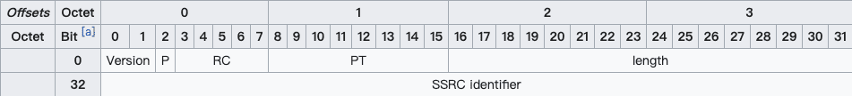

# RTP、RTCP、RTSP 概念

**用一句简单的话总结：RTSP发起/终结流媒体、RTP传输流媒体数据 、RTCP对RTP进行控制、同步。**

**之所以以前对这几个有点分不清，是因为CTC标准里没有对RTCP进行要求，因此在标准RTSP的代码中没有看到相关的部分。而在私有RTSP的代码中，有关控制、同步等，是在RTP Header中做扩展定义实现的。**

**另外，RFC3550可以看作是RFC1889的升级文档，只看RFC3550即可。**

# RTP

RTP（Real-time Transport Protocol)是用于Internet上针对多媒体数据流的一种传输层协议。RTP协议详细说明了在互联网上传递音频和视频的标准数据包格式。RTP协议常用于流媒体系统（配合RTCP协议），视频会议和一键通（Push to Talk）系统（配合H.323或SIP），使它成为IP电话产业的技术基础。RTP协议和RTP控制协议RTCP一起使用，而且它是建立在UDP协议上的。
RTP 本身并没有提供按时发送机制或其它服务质量（QoS）保证，它依赖于低层服务去实现这一过程。 RTP 并不保证传送或防止无序传送，也不确定底层网络的可靠性。 RTP 实行有序传送， RTP 中的序列号允许接收方重组发送方的包序列，同时序列号也能用于决定适当的包位置，例如：在视频解码中，就不需要顺序解码。
RTP 由两个紧密链接部分组成： RTP--传送具有实时属性的数据；RTP 控制协议（RTCP）--监控服务质量并传送正在进行的会话参与者的相关信息。

## RTP header 


一个RTP 包 由 RTP header + payload组成。如图所示，RT(D)P header 最小为 12 bytes；红色部分为可选字段。字段的含义分别如下：

- **Version** 表示 RTP 协议的版本，目前版本为 2。
- **P (Padding)** 表示 RT(D)P 包末尾是否有 padding bytes，且 padding bytes 的最后一个 byte 表示 bytes 的数量。Padding 可以被用来填充数据块，比如加密算法可能会用到。
- **X (Extension)** 表示是否有头部扩展，头部扩展可以用于存储信息，比如视频旋转角度。
- **CC (CSRC count)** 表示红色部分的 CSRC（参见下文）数量，显然最多只能有 15 个 CSRC。
- **M (Marker)** 表示当前数据是否与应用程序有某种特殊的相关性。比如传输的是一些私有数据，或者数据中的某些标志位具有特殊的作用。
- **PT (Payload type)** 表示 payload 的数据类型，音视频的默认映射格式可参见 [RFC 3551](https://tools.ietf.org/html/rfc3551#page-32)。
- **Sequence number** 是递增的序列号，用于标记每一个被发送的 RT(D)P 包。接收方可以根据序列号按顺序重新组包，以及识别是否有丢包。序列号的初始值应当是随机的（不可预测的），从而增加明文攻击的难度。
- **Timestamp** 即时间戳，接收方根据其来回放音视频。时间戳的间隔由传输的数据类型（或具体的应用场景）确定，比如音频通常以 125µs（8kHz）的时钟频率进行采样，而视频则以 90kHz 的时钟频率采样。这里时间戳的初始值也是随机选取的，是一种相对时间戳。
- **SSRC (Synchronization source)** 即同步源标识符。相同 RTP 会话中的 SSRC 是唯一的，且生成的 SSRC 也需要保持随机。尽管多个源选中同一个标识符的概率很低，但具体实现时仍然需要这种情况发生，即避免碰撞。
- **CSRC (Contributing source)** 在 MCU 混流时使用，表示混流出的新的音视频流的 SSRC 是由哪些源 SSRC 贡献的。根据上述 CC 得知，我们最多可以同时混 15 路音视频流。
- **Extension header** 即头部扩展，包含了音视频的一些额外信息，比如视频旋转角度。

# RTCP

实时传输控制协议（Real-time Transport Control Protocol或RTP Control Protocol或简写RTCP）是实时传输协议（RTP）的一个姐妹协议。RTCP为RTP媒体流提供信道外（out-of-band）控制。RTCP本身并不传输数据，但和RTP一起协作将多媒体数据打包和发送。RTCP定期在流多媒体会话参加者之间传输控制数据。RTCP的主要功能是为RTP所提供的服务质量（Quality of Service）提供反馈。

RTCP收集相关媒体连接的统计信息，例如：传输字节数，传输分组数，丢失分组数，jitter，单向和双向网络延迟等等。网络应用程序可以利用RTCP所提供的信息试图提高服务质量，比如限制信息流量或改用压缩比较小的编解码器。RTCP本身不提供数据加密或身份认证。SRTCP可以用于此类用途。

## RTCP header

在传统的实时通讯过程中，RT(D)P 协议占用偶数位的端口，而 RTCP 协议占用随后的奇数位端口。不过如果接收方的 SDP 中包含 `rtcp-mux` 字段 [6](https://mthli.xyz/rtp-introduction/#fn-6)，即表明接收方支持 RT(D)P 协议和 RTCP 协议共用同一个端口，即多路复用。在 Chrome 57 版本已经强制开启了 `rtcp-mux` 。

对于 RTCP 包而言，我们不只要关注 header 的结构，还要关注具体的 report block 内容。不过我们先来看一个典型的 RTCP header 结构，如下图 [7](https://mthli.xyz/rtp-introduction/#fn-7) 所示：



RTCP header 的固定大小为 8 bytes，其中 Version、P、SSRC 的含义同上述 RTP header 相同，在此不与赘述。其他几个字段的含义分别如下：

- **RC (Reception report count)** 表示当前 RTCP 包有几个 block，显然最多只能有 32 个。
- **PT (Packet type)** 表示 RTCP 包的类型，比如 SR=200、RR=201（SR、RR 参见下文）。
- **Length** 等于整个 RTCP 包的长度**减一**（使得 Length = 0 是合法的），其值包含 header 的长度和所有 padding 占用的空间长度。值的单位是以 32 位字长（32-bit words）描述的。

## SR & RR

PT=SR=200 时，表示这个 RTCP 包记录的是**发送方**的质量数据（Sender Report）；PT=RR=201 时，表示这个 RTCP 包记录的是**接收方**的质量数据（Receiver Report）。SR 和 RR 的结构几乎一致，除了 RR 没有 sender info。先来看 SR 的结构：

```Shell
0                   1                   2                   3
        0 1 2 3 4 5 6 7 8 9 0 1 2 3 4 5 6 7 8 9 0 1 2 3 4 5 6 7 8 9 0 1
       +-+-+-+-+-+-+-+-+-+-+-+-+-+-+-+-+-+-+-+-+-+-+-+-+-+-+-+-+-+-+-+-+
header |V=2|P|    RC   |   PT=SR=200   |             length            |
       +-+-+-+-+-+-+-+-+-+-+-+-+-+-+-+-+-+-+-+-+-+-+-+-+-+-+-+-+-+-+-+-+
       |                         SSRC of sender                        |
       +=+=+=+=+=+=+=+=+=+=+=+=+=+=+=+=+=+=+=+=+=+=+=+=+=+=+=+=+=+=+=+=+
sender |              NTP timestamp, most significant word             |
info   +-+-+-+-+-+-+-+-+-+-+-+-+-+-+-+-+-+-+-+-+-+-+-+-+-+-+-+-+-+-+-+-+
       |             NTP timestamp, least significant word             |
       +-+-+-+-+-+-+-+-+-+-+-+-+-+-+-+-+-+-+-+-+-+-+-+-+-+-+-+-+-+-+-+-+
       |                         RTP timestamp                         |
       +-+-+-+-+-+-+-+-+-+-+-+-+-+-+-+-+-+-+-+-+-+-+-+-+-+-+-+-+-+-+-+-+
       |                     sender's packet count                     |
       +-+-+-+-+-+-+-+-+-+-+-+-+-+-+-+-+-+-+-+-+-+-+-+-+-+-+-+-+-+-+-+-+
       |                      sender's octet count                     |
       +=+=+=+=+=+=+=+=+=+=+=+=+=+=+=+=+=+=+=+=+=+=+=+=+=+=+=+=+=+=+=+=+
report |                 SSRC_1 (SSRC of first source)                 |
block  +-+-+-+-+-+-+-+-+-+-+-+-+-+-+-+-+-+-+-+-+-+-+-+-+-+-+-+-+-+-+-+-+
  1    | fraction lost |       cumulative number of packets lost       |
       +-+-+-+-+-+-+-+-+-+-+-+-+-+-+-+-+-+-+-+-+-+-+-+-+-+-+-+-+-+-+-+-+
       |           extended highest sequence number received           |
       +-+-+-+-+-+-+-+-+-+-+-+-+-+-+-+-+-+-+-+-+-+-+-+-+-+-+-+-+-+-+-+-+
       |                      interarrival jitter                      |
       +-+-+-+-+-+-+-+-+-+-+-+-+-+-+-+-+-+-+-+-+-+-+-+-+-+-+-+-+-+-+-+-+
       |                         last SR (LSR)                         |
       +-+-+-+-+-+-+-+-+-+-+-+-+-+-+-+-+-+-+-+-+-+-+-+-+-+-+-+-+-+-+-+-+
       |                   delay since last SR (DLSR)                  |
       +=+=+=+=+=+=+=+=+=+=+=+=+=+=+=+=+=+=+=+=+=+=+=+=+=+=+=+=+=+=+=+=+
report |                 SSRC_2 (SSRC of second source)                |
block  +-+-+-+-+-+-+-+-+-+-+-+-+-+-+-+-+-+-+-+-+-+-+-+-+-+-+-+-+-+-+-+-+
  2    :                               ...                             :
       +=+=+=+=+=+=+=+=+=+=+=+=+=+=+=+=+=+=+=+=+=+=+=+=+=+=+=+=+=+=+=+=+
       |                  profile-specific extensions                  |
       +-+-+-+-+-+-+-+-+-+-+-+-+-+-+-+-+-+-+-+-+-+-+-+-+-+-+-+-+-+-+-+-+
```

对于 SR 而言，sender info 结构中的字段含义分别如下：

- **NTP timestamp** 即 NTP 时间戳。完整的 NTP 时间戳为 64 位无符号定点（fixed-point）数，可以和 RR 中的时间戳计算出对应接收方的 Round-Trip Time（RTT）。
- **RTP timestamp** 对应上述 NTP 时间戳的同一时间，但是与 RT(D)P 时间戳的单位和偏移量保持一致。这种对应关系可以用于媒体源的帧间或帧内同步（如果它们的 NTP 时间戳也是同步的话），也可以被媒体无关（media-independent）的接收方用于估算 RTP 时钟频率。
- **sender’s packet count** 即截止到当前 SR 生成时，发送方一共传输了多少个 RT(D)P 包。如果发送方的 SSRC 改变了，则该计数值将会被重置。
- **sender’s octet count** 即截止到当前 SR 生成时，发送方一共传输了多少个 RT(D) payload 字节（并不包括 header 和 padding）。如果发送方的 SSRC 改变了，则该计数值将会被重置。这个值可以被用来估算**有效负载**的平均传输速率。

SR 和 RR 具有相同的 report block 结构，其中各个字段的含义分别如下：

1. **fraction lost** 表示最近一次 SR 或 RR 发送后，对应 SSRC 的发送方的 RT(D)P 丢包率，为 8 位定点数，换算为百分比的公式为 `percentage = fractionLost * 100 / 256` 。值等于发送方实际丢包数（参见下文）除以接收方期望收到的包数量（参见下文）。
2. **packets lost** 表示截止到当前实时通话时，对应 SSRC 的发送方的 RT(D)P 累计丢包数。值等于接收方期望收到的包数量减去实际收到的包数量，即上述「发送方实际丢包数」。
3. **extended highest sequence number received** 低 16 位为接收方从对应 SSRC 的发送方收到的最大的 RT(D)P sequence number，高 16 位为对应的 sequence number 循环次数。而对应的计算值便是上述「接收方期望收到的包数量」。
4. **interarrival jitter** 为接收方收到 RT(D)P 包的间隔时间的统计方差，为无符号整数时间值。
5. **LSR** 表示接收方收到对应 SSRC 的发送方的最近一次 SR 中的 NTP 时间戳，采用的是更加紧凑的 32 位表示方法。如果没有 SR 被收到过，则这个值为零。
6. **DLSR** 表示接收方收到对应 SSRC 的发送方的最近一次 SR 的时间，和接收方发送 RR 的时间差，单位为 `1/65536` 秒。如果没有 SR 被收到过，则这个值为零。

细心的读者可能会发现，report block 中的字段基本都与接收方有关，即与 RR 有关。事实也的确如此，RR 的 report block 内容只与 SR 的 header、sender info 以及接收时间有关，因此 SR 的 report block 是可有可无的。比如笔者在实际工作中使用的 mediasoup（SFU）便是选择自己消费掉所有收到的 SR，而它生成的新的 SR 并不包含 report block [8](https://mthli.xyz/rtp-introduction/#fn-8)。

# SRTP & SRTCP

安全实时传输协议（Secure Real-time Transport Protocol或SRTP）是在实时传输协议（Real-time Transport Protocol或RTP）基础上所定义的一个协议，旨在为单播和多播应用程序中的实时传输协议的数据提供加密、消息认证、完整性保证和重放保护。它是由David Oran（思科）和Rolf Blom（爱立信）开发的，并最早由IETF于2004年3月作为RFC 3711发布。

由于实时传输协议和可以被用来控制实时传输协议的会话的实时传输控制协议（RTP Control Protocol或RTCP）有着紧密的联系，安全实时传输协议同样也有一个伴生协议，它被称为安全实时传输控制协议（Secure RTCP或SRTCP）；安全实时传输控制协议为实时传输控制协议提供类似的与安全有关的特性，就像安全实时传输协议为实时传输协议提供的那些一样。

在使用实时传输协议或实时传输控制协议时，使不使用安全实时传输协议或安全实时传输控制协议是可选的；但即使使用了安全实时传输协议或安全实时传输控制协议，所有它们提供的特性（如加密和认证）也都是可选的，这些特性可以被独立地使用或禁用。唯一的例外是在使用安全实时传输控制协议时，必须要用到其消息认证特性。

# RTSP

RTSP（Real Time Streaming Protocol）是用来控制声音或影像的多媒体串流协议，并允许同时多个串流需求控制，传输时所用的网络通讯协定并不在其定义的范围内，服务器端可以自行选择使用TCP或UDP来传送串流内容，它的语法和运作跟HTTP 1.1类似，但并不特别强调时间同步，所以比较能容忍网络延迟。而前面提到的允许同时多个串流需求控制（Multicast），除了可以降低服务器端的网络用量，更进而支持多方视讯会议（Video Conference）。 因为与HTTP1.1的运作方式相似，所以代理服务器 (Proxy) 的快取功能 (Cache) 也同样适用于RTSP，并因RTSP具有重新导向功能，可视实际负载情况来转换提供服务的服务器，以避免过大的负载集中于同一服务器而造成延迟。


# 参考文献

- [RTP、RTCP、RTSP 概念](https://developer.aliyun.com/article/48045)