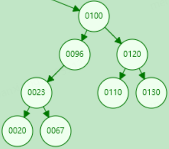
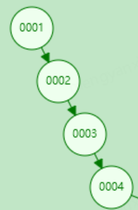

# 1. 树的定义

 树是n个结点的有限集合.n=0时称为空树.在任意一棵非空树中:

- 有且仅有一个特定的称为根(Root)的结点;
- 当n>1时,其余结点可以分为m个互不相交的有限集T1,T2......Tm,其中每一个集合本身又是一课树,并且称为根的子树(SubTree)

- 度: 结点拥有的子树的个数称为结点的度(Degree),度为0的结点称为叶节点或者终端结点.度不为0的结点称为非终端结点或者分支结点

  

- 树的度是树的各个结点度的最大值
- 深度或高度: 树中结点的最大层次称为树的深度或高度

- 有序树和无序树
- 森林是m棵互不相交的树的集合

# 2. 二叉树

> https://www.jianshu.com/p/bf73c8d50dc2

**二叉树(Binary Tree)是n(n>=0)个结点的有限集合,该集合或者为空集(称为空二叉树), 或者由一个根节点和两棵互不相交的,分别称为根节点的左子树和右子树的二叉树组成**

**二叉树的特点:**

- 每个结点最多有两颗子树，所以二叉树中不存在度大于2的结点。
- 左子树和右子树是有顺序的，次序不能任意颠倒。
- 即使树中某结点只有一棵子树，也要区分它是左子树还是右子树。

特殊二叉树

**斜树: 所有的结点都只有左子树的二叉树叫左斜树。所有结点都是只有右子树的二叉树叫右斜树。这两者统称为斜树。**

# 3. 满二叉树

**满二叉树: 在一棵二叉树中。如果所有分支结点都存在左子树和右子树，并且所有叶子都在同一层上，这样的二叉树称为满二叉树**

- 叶子只能出现在最下一层。出现在其它层就不可能达成平衡
- 非叶子结点的度一定是2
- 在同样深度的二叉树中，满二叉树的结点个数最多，叶子数最多.**并且叶子都处于同一层**

满二叉树

# 4. 完全二叉树

**完全二叉树: 对一颗具有n个结点的二叉树按层编号，如果编号为i(1<=i<=n)的结点与同样深度的满二叉树中编号为i的结点在二叉树中位置完全相同，则这棵二叉树称为完全二叉树**

完全二叉树

**特点:**

1）叶子结点只能出现在最下层和次下层。
2）最下层的叶子结点集中在树的左部。
3）倒数第二层若存在叶子结点，一定在右部连续位置。
4）如果结点度为1，则该结点只有左孩子，即没有右子树。
5）同样结点数目的二叉树，完全二叉树深度最小。

**注**：满二叉树一定是完全二叉树，但反过来不一定成立。

# 5. 二叉查找树（BST）

**二叉查找树定义**：又称为是**二叉排序树**（Binary Sort Tree）或**二叉搜索树**。二叉排序树或者是一棵空树，或者是具有下列性质的二叉树：

- 若左子树不空，则左子树上所有结点的值均小于它的根结点的值；
- 若右子树不空，则右子树上所有结点的值均大于或等于它的根结点的值；
- 左、右子树也分别为二叉排序树；
- 没有键值相等的节点。

　　**二叉查找树的性质：**对二叉查找树进行中序遍历，即可得到有序的数列。

　　**二叉查找树的时间复杂度：它和二分查找一样，插入和查找的时间复杂度均为O(logn)，但是在最坏的情况下仍然会有O(n)的时间复杂度。原因在于插入和删除元素的时候，树没有保持平衡（。我们追求的是在最坏的情况下仍然有较好的时间复杂度，这就是平衡查找树设计的初衷。**

　　**二叉查找树的高度决定了二叉查找树的查找效率。**

　　**二叉查找树的插入过程如下：**

- 若当前的二叉查找树为空，则插入的元素为根节点;
- 若插入的元素值小于根节点值，则将元素插入到左子树中;
- 若插入的元素值不小于根节点值，则将元素插入到右子树中。

　　**二叉查找树的删除，分三种情况进行处理：**

　　1) p为叶子节点，直接删除该节点，再修改其父节点的指针（注意分是根节点和不是根节点），如图a;

　　2) p为单支节点（即只有左子树或右子树）。让p的子树与p的父亲节点相连，删除p即可（注意分是根节点和不是根节点），如图b;

　　3) p的左子树和右子树均不空。找到p的后继y，因为y一定没有左子树，所以可以删除y，并让y的父亲节点成为y的右子树的父亲节点，并用y的值代替p的值；或者方法二是找到p的前驱x，x一定没有右子树，所以可以删除x，并让x的父亲节点成为y的左子树的父亲节点。如图c。

# 6. 平衡二叉树（AVL）

参考文章： https://zhuanlan.zhihu.com/p/56066942

> 为什么有平衡二叉树
>
> 二叉搜索树一定程度上可以提高搜索效率，但是当原序列有序时，例如序列 A = {1，2，3，4，5，6}，构造二叉搜索树如图 1.1。依据此序列构造的二叉搜索树为右斜树，同时二叉树退化成单链表，搜索效率降低为 O(n)
>
> 

**平衡二叉查找树**：简称平衡二叉树，它具有如下几个性质：

- 可以是空树。
- 假如不是空树，任何一个结点的左子树与右子树都是平衡二叉树，并且高度之差的绝对值不超过 1。

**平衡因子**

**定义：**某节点的左子树与右子树的高度(深度)差即为该节点的平衡因子（BF,Balance Factor），平衡二叉树中不存在平衡因子大于 1 的节点。在一棵平衡二叉树中，节点的平衡因子只能取 0 、1 或者 -1 ，分别对应着左右子树等高，左子树比较高，右子树比较高。

# 7. 红黑树

# 8. B树

>  B-树就是B树,-只是一个符号. 

**B树(B-Tree)是一种自平衡的树**，它是一种多路搜索树（并不是二叉的），能够保证数据有序。同时它还保证了在查找、插入、删除等操作时性能都能保持在`O(logn)`，为大块数据的读写操作做了优化，同时它也可以用来描述外部存储(支持对保存在磁盘或者网络上的符号表进行外部查找)。

**特点：**
 1.定义任意非叶子结点最多只有`M`个儿子；且`M>2`
 2.根结点的儿子数为`[2, M]`
 3.除根结点以外的非叶子结点的儿子数为`[M/2, M]`
 4.每个结点存放至少`M/2-1`（取上整）和至多`M-1`个关键字；（至少2个关键字）
 5.非叶子结点的关键字个数=指向儿子的指针个数-1
 6.非叶子结点的关键字：`K[1], K[2], …, K[M-1]；且K[i] < K[i+1]`
 7.非叶子结点的指针：`P[1], P[2], …, P[M]`，其中`P[1]`指向关键字小于`K[1]`的子树，`P[M]`指向关键字大于`K[M-1]`的子树，其它`P[i]`指向关键字属于`(K[i-1], K[i])`的子树
 8.所有叶子结点位于同一层

如：（M=3）

# 9. B+树

B+树是在B树的基础上又一次的改进，其主要对两个方面进行了提升，一方面是查询的稳定性，另外一方面是在数据排序方面更友好。

**B+树构建规则**

（1）B+树的**非叶子**节点**不保存具体的数据，而只保存关键字的索引**，而所有的数据最终都会保存到叶子节点。因为所有数据必须要到叶子节点才能获取到，所以每次数据查询的次数都一样，这样一来B+树的查询速度也就会比较稳定，而B树的查找过程中，不同的关键字查找的次数很有可能都是不同的（有的数据可能在根节点，有的数据可能在最下层的叶节点），所以在数据库的应用层面，B+树就显得更合适。

（2）B+树叶子节点的关键字从小到大有序排列，左边结尾数据都会保存右边节点开始数据的指针。因为叶子节点都是有序排列的，所以B+树对于数据的排序有着更好的支持。

（3）非叶子节点的子节点数=关键字数（来源百度百科）（根据各种资料 这里有两种算法的实现方式，另一种为非叶节点的关键字数=子节点数-1（来源维基百科)，虽然他们数据排列结构不一样，但其原理还是一样的Mysql 的B+树是用第一种方式实现）;

**B+树和B树的对比**

- B+**树查询速度更稳定**：B+所有关键字数据地址都存在**叶子**节点上，所以每次查找的次数都相同所以查询速度要比B树更稳定。
- B+**树天然具备排序功能：**B+树所有的**叶子**节点数据构成了一个有序链表，在查询大小区间的数据时候更方便，数据紧密性很高，缓存的命中率也会比B树高。
- B+**树全节点遍历更快：**B+树遍历整棵树只需要遍历所有的**叶子**节点即可，而不需要像B树一样需要对每一层进行遍历，这有利于数据库做全表扫描。
- **B树**相对于**B+树**的优点是，如果经常访问的数据离根节点很近，而**B树**的**非叶子**节点本身存有关键字和数据，所以在查询这种数据检索的时候会要比**B+树**快。

